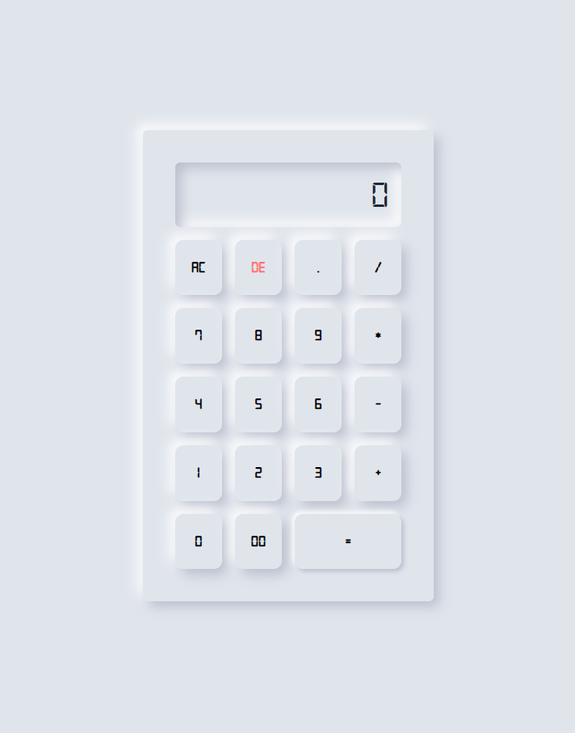

# neumorphism calculator

This is a simple calculator application designed with a neumorphism aesthetic. Neumorphism, also known as "soft UI," is a design trend that creates a soft, three-dimensional effect by combining elements of skeuomorphism and flat design. This calculator features a minimalistic and elegant look with smooth shadows and subtle depth effects.

